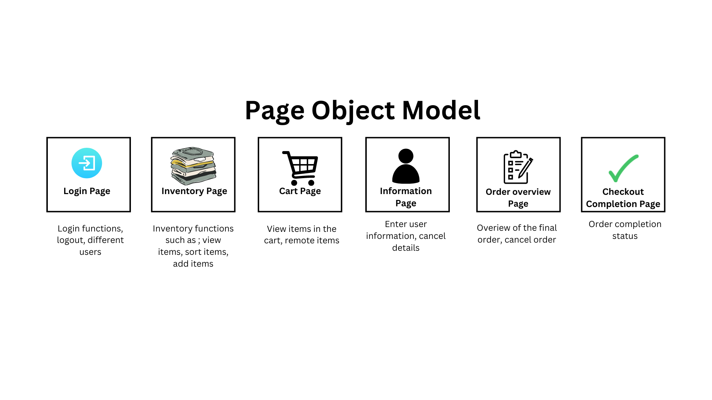

# Swaglabs Automation using Playwright:TS

Using Playwright to automate [Swag Labs Demo website](https://www.saucedemo.com/).

## Test Cases

The following testcases have been automated

- As a shopper, I want to login to swag labs website, so that I can view and purchase items

### Metrices

1. Test Case Coverage
2. Automated test coverage

### Automation structure

### Key element types

1. textboxes
2. buttons
3. lists

## Project Setup and Execution

1. Install nodejs
2. Install playwright

### Commands for execution

    | Command                         | Purpose                                |
    | --------------------------------| -------------------------------------- |
    | npx playwright test             | Runs the end-to-end tests              |
    | npx playwright show-report      | Generate HTML report of the results    |
    | npx playwright test             |                                        |
    | --project=chromium              | Runs the tests only on Desktop Chrome. |
    | npx playwright test --debug     | Debug Mode                             |
    | npx playwright test example     | Run specific file                      |

### References
